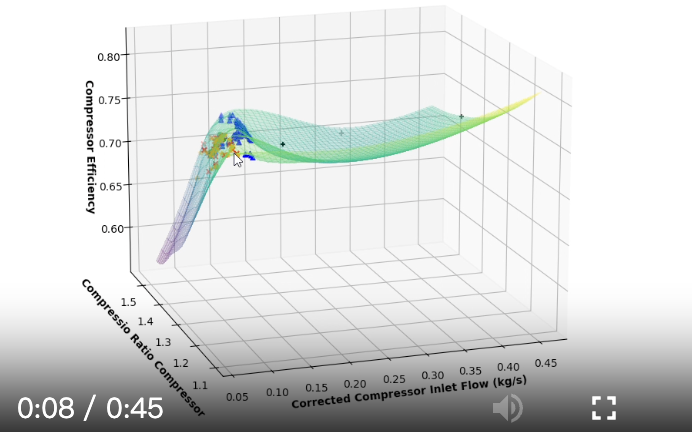

# 第三章 xxxxx说明

## 3.1 问题与假设

xxxx
xxxxx
xxxxx

## 3.2 研究目标
xxxxx
1. xxxx
2. xx
xxxxxxx

4. xxxxxx
xxxxxxx
xxx。

$$ \eta_{ise} = \frac{\text{Actual work done by the fluid}}{\text{Maximum energy difference possible for the fluid}} \approx \frac{\dot{m} C_p (T_{0,1} - T_{0,2})}{\dot{m} C_p (T_{0,1} - T_{0,2ise})} $$

$$ \eta_{ise} = \frac{(T_{0,1}/T_{0,2})-1}{(P_{0,1}/P_{0,2})^{(\gamma-1)/\gamma} - 1}$$

表3-19 控制器组件

| 符号 | 名称和功能 |
|---|---|
| 1 | **测量表 (Gauge)**：测量表组件只能接受一个从节点或组件分支获取的测量输入信号。测量的例子有压力、温度、密度、流量等。输出信号是测量表中选择的测量值。 |
| 2 | **控制器模板 (Controller Template)**：用于基于自定义脚本和/或绘图（二维线或三维曲面）创建自定义输出信号。该模板最多可以接受五个来自测量表或表格组件的输入信号。 |
| 3 | **表格控制器 (Tabular Controller)**：当需要一个值来计算一个不属于控制器模板的测量值时，该值将输入到表格控制器并连接到控制器模板的输入之一。表格控制器没有输入端口。 |
